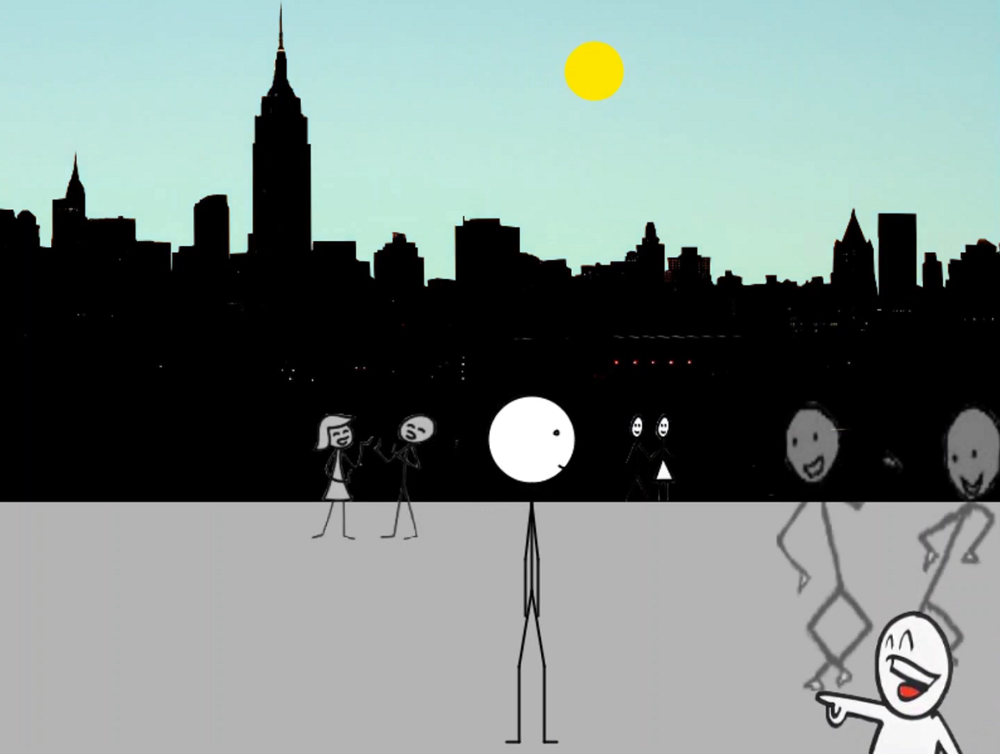
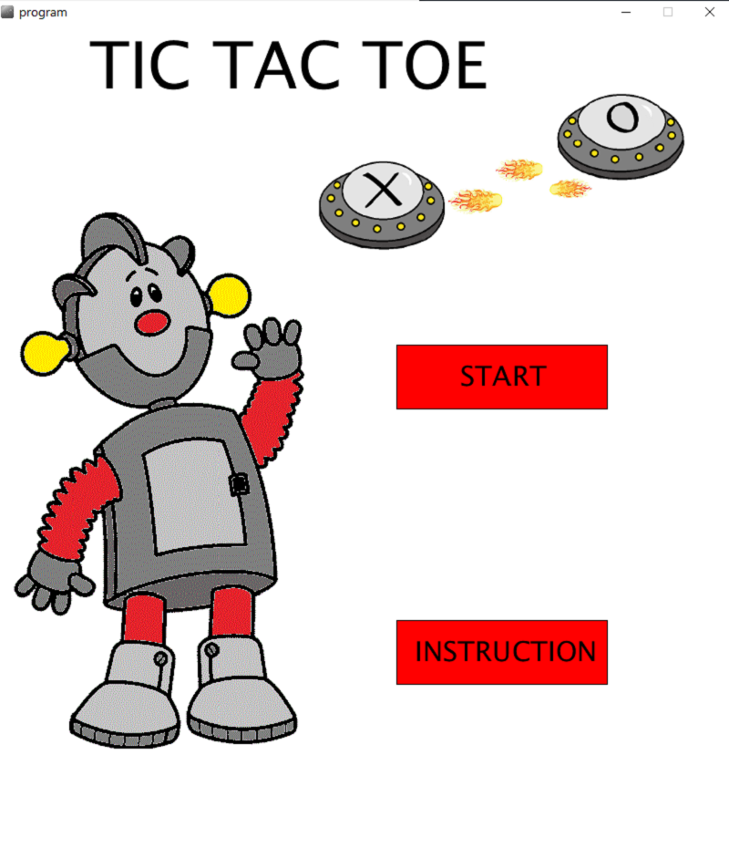

# Processing-Projects

This repository is dedicated to two of my very first self-supervised school projects in Processing.
It contains the implementation of a two-minute animation and of an interactive Tic Tac Toe game.

  
   
  

The full animation can be watched [here](https://youtu.be/5g5aKYJhM1g).

## Getting Started

These instructions will get you a copy of the projects running on your local machine.  

### Prerequisites

Please install [Processing 2](https://processing.org/download/). ( ⚠️ I cannot guarantee that the code runs properly in more recent versions.)

## Running the code

### Animation
Download the ./Animation/program folder. Open the program.pde file in the Processing Development Environment (PDE) and run the code.
Since I am not allowed to publicly share the underlying sound file, feel free to add your own .wav audio file. To do so, store it in ./data and change its name to 'song'. Finally, comment in all lines of code associated with the audio (in total 6 LoC).

### Tic Tact Toe
Download the ./Tic-Tac-Toe/program folder. Open the program.pde file in the Processing Development Environment (PDE) and run the code. And that should be it!

## Troubleshooting

* If you tried to add an audio file to the animated video but the audio does not play, ensure that you added it to the associated ./data folder. Also ensure that you commented in all required lines of code in the program (this should be in total 6 lines). 
* If the audio still does not play, ensure that you named the file correctly and that it has the required format. 
* Ensure that you are using Processing 2 because Processing 3 does not support the import of ddf.minim.* anymore (relevant for the animation program). 

## Built With

* [Processing 2.1](https://processing.org/download/) - Coded in PDE

